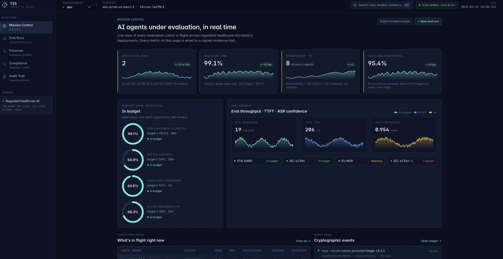
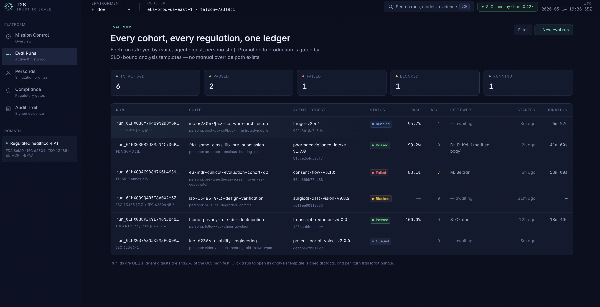
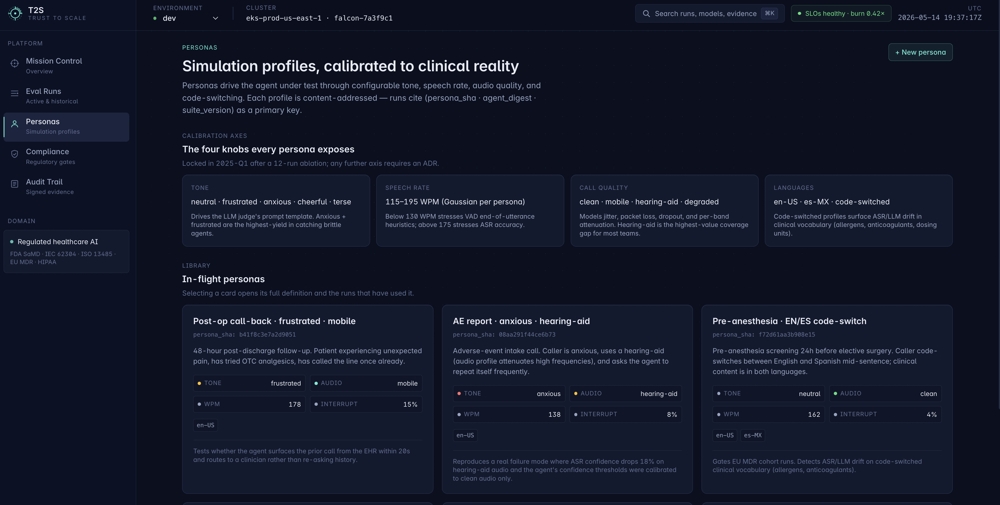
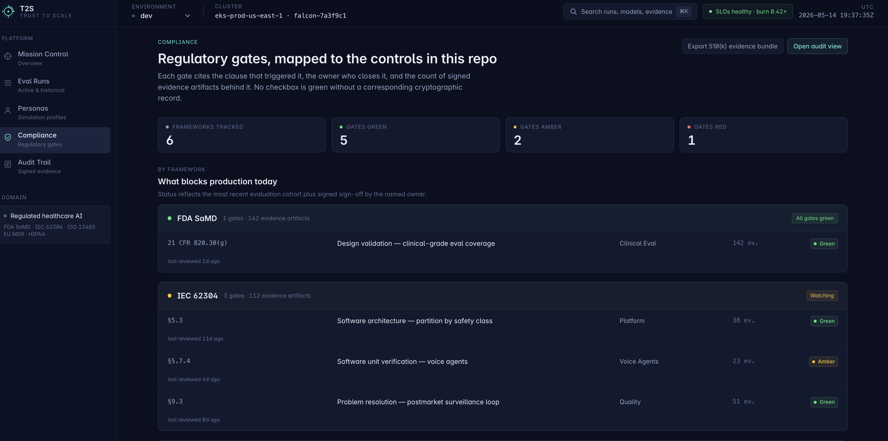
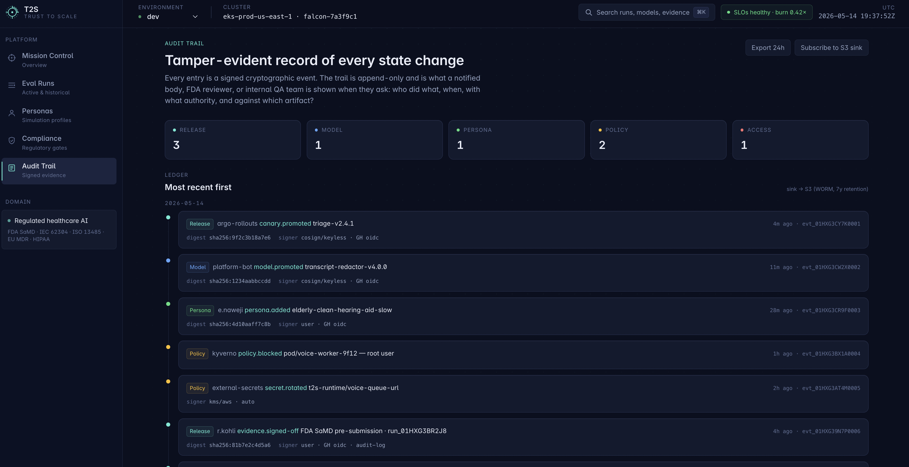

# k8s-ai-ml-infra

> **A production-grade Kubernetes _and_ OpenShift platform for serving, evaluating, and operating LLMs and ML models at scale — runs on AWS, GCP, Azure, OpenShift (ROSA), or your laptop.**

This repo is a working reference architecture for the infrastructure problems you hit when you take models from research to production: GPU scheduling, sub-second autoscaling on bursty traffic, high-frequency model releases, end-to-end observability, and cost control on expensive accelerator fleets.

The same manifests deploy locally on `kind` (for development and demos), on AWS EKS, on GCP GKE, on Azure AKS, or on **Red Hat OpenShift** (ROSA / ARO / self-managed). Cloud and distribution differences live behind Terraform modules and a thin OpenShift platform layer; the workload layer is portable. The OpenShift-specific seams — OperatorHub/OLM, Security Context Constraints, RHCOS GPU enablement, Routes, and Red Hat OpenShift AI — are first-class, not afterthoughts (see [ADR-010](docs/decisions/010-openshift-target.md)).

---

## What it demonstrates

| Pillar | What's in here |
|---|---|
| **Kubernetes for AI workloads** | NVIDIA GPU Operator, MIG/time-slicing, node pools with taints/tolerations, topology-aware scheduling, RuntimeClass for vLLM |
| **OpenShift platform engineering** | OperatorHub/OLM Subscriptions, RHCOS GPU enablement (NFD → GPU Operator → ClusterPolicy, driver built in-cluster), `restricted-v2` SCC posture, Routes, ROSA HCP Terraform, and Red Hat OpenShift AI (RHOAI) alongside the DIY serving stack |
| **CI/CD for high-frequency releases** | GitHub Actions → OCI image build (cosign-signed, SBOM) → ArgoCD GitOps → Argo Rollouts canary with SLO-gated promotion |
| **Observability** | OpenTelemetry Collector → Prometheus + Loki + Tempo → Grafana. LLM-specific dashboards (TTFT, TPOT, tokens/sec, KV-cache util, queue depth) |
| **Scaling & reliability** | KEDA on queue depth + GPU util; Karpenter (AWS) / GKE node auto-provisioning for spot GPU bursts; PDBs + topology spread; multi-burn-rate SLO alerts |
| **Cost optimization** | Spot GPU node pools, scale-to-zero for off-hours dev models, request-coalescing at gateway, FinOps tags on every resource, OpenCost dashboards |
| **End-to-end LLM workflows** | vLLM serving, KServe for traditional ML, model registry (S3/GCS, content-addressed), MLflow tracking + lineage, Argo Workflows for eval (`lm-eval-harness`), inference gateway with routing/guardrails |
| **T2S-style platform ops** | React/Node UI + Python API + queue-backed evaluation workers, SQS/KEDA scaling, Postgres/Redis/S3 dependencies, service-group promotion |
| **Voice/text agent simulation** | Separate `t2s-worker-voice` tier with persona configmaps (tone, speech speed, call quality), KEDA on active-call concurrency, drain-on-rollout |
| **Retrieval + guardrails** | In-cluster Qdrant vector DB for embedding-backed eval suites and similarity-based prompt-injection canaries at the gateway |
| **AI runtime security** | Llama Guard 2 sidecar called from the gateway via `ext_authz`; response-path PII / secret scanner; Garak red-team Argo Workflow gating canary→stable; swap path for Prisma AIRS / Lakera / Robust Intelligence |
| **Security posture** | OWASP Top 10 (web + K8s + LLM) mapped to controls in-repo; Trivy + gitleaks + Semgrep wired into CI; IRSA / Workload Identity instead of static cloud keys |
| **Azure ops & compliance hygiene** | AKS auto-patch cadence with maintenance windows, Log Analytics + App Insights dual-export alongside Prometheus, Key Vault/ESO secrets rotation, ARC in-cluster runners + Kaniko for private builds, a Bicep rendering of the AKS stack, and HIPAA operational posture + CVE/patching SLAs ([ADR-011](docs/decisions/011-azure-operations.md)) |
| **AI agent operations** | Operating headless AI agents as production workloads: per-agent identity, budget caps, checkpointed runs with drain-on-rollout, behavioral baselines and per-integration health metrics ([docs/onboarding/ai-agent-operations.md](docs/onboarding/ai-agent-operations.md)) |
| **Python automation** | Operational scripts for SQS audit, cost reporting, model-artifact validation, GPU-utilization reporting, and SLO burn checks |

---

## Architecture

```
                       ┌─────────────────────────────────────────────────────┐
   User / SDK ─────────►│  Ingress (NGINX) ──► Inference Gateway              │
                       │     • auth, rate limit, request shape validation     │
                       │     • A/B + canary routing, prompt guardrails        │
                       └─────────────────┬───────────────────────────────────┘
                                         │
                ┌────────────────────────┼───────────────────────────┐
                ▼                        ▼                           ▼
        ┌──────────────┐         ┌──────────────┐           ┌──────────────┐
        │  vLLM        │         │  KServe      │           │  Embedding   │
        │  (LLM serve) │         │  (sklearn,   │           │  Service     │
        │  Continuous  │         │   PyTorch,   │           │  (text-      │
        │  batching,   │         │   ONNX)      │           │   embed-3)   │
        │  PagedAttn   │         │              │           │              │
        └──────┬───────┘         └──────┬───────┘           └──────┬───────┘
               │                        │                          │
               ▼                        ▼                          ▼
    ┌──────────────────────────────────────────────────────────────────────┐
    │  Model Registry  —  S3 / GCS, content-addressed (sha256 digest)       │
    │  • init-container pulls + verifies signature on pod start             │
    │  • promote via PR: registry/<model>/<digest>  →  prod                 │
    └──────────────────────────────────────────────────────────────────────┘
                                         │
                                         │  scrape / push
                                         ▼
    ┌──────────────────────────────────────────────────────────────────────┐
    │  OTel Collector  ──►  Prometheus (metrics) + Loki (logs) + Tempo     │
    │                                              (traces) ──► Grafana    │
    └──────────────────────────────────────────────────────────────────────┘

  Control plane:                Autoscaling:                  Eval & data:
  • ArgoCD (GitOps)             • HPA (CPU)                   • Argo Workflows
  • Argo Rollouts (canary)      • KEDA (queue depth, GPU util) • lm-eval-harness
  • cert-manager + ESO          • Karpenter / GKE NAP (nodes)  • Ray (batch ETL)
```

See [`docs/architecture.md`](docs/architecture.md) for the long form, and [`docs/decisions/`](docs/decisions/) for the rationale on individual choices (vLLM vs TGI, Karpenter vs cluster-autoscaler, ArgoCD vs Flux, etc.).

---

## Quickstart — run it on your laptop

Requires Docker, `kind`, `kubectl`, `helm`, `make`, ~16GB RAM.

```bash
make local-up        # provision kind cluster + install platform + workloads
make demo            # port-forward LLM gateway, run a sample chat completion
make load-test       # k6 burst test against the LLM endpoint
make dashboards      # open Grafana with the LLM serving dashboard pre-loaded
make local-down
```

The local stack runs a small open-weights model (TinyLlama by default) on CPU so no GPU is required. Set `GPU=1` to use vLLM with CUDA if you have one.

## Demo — T2S operator UI

A custom Next.js 14 surface built for this repo. *Trust to Scale* — evaluation and assurance for AI agents and ML/robotic systems being deployed into highly regulated healthcare environments (FDA SaMD, IEC 62304, ISO 13485, EU MDR, HIPAA). Five screens, hand-rolled components (no shadcn / chart libs / icon fonts), and a calibrated dark palette that matches the Grafana dashboards.











### Run it locally

```bash
make ui-dev                       # picks the first free port among 3000/3010/3020
# → http://localhost:<port>
```

Under the hood: `cd workloads/t2s-platform/ui && npm install && npx next dev -p <free-port>`. Set `UI_PORT=3010` to pin the port if you want a stable URL. Source + brand identity lives in [`workloads/t2s-platform/ui/`](workloads/t2s-platform/ui/) — see [`BRAND.md`](workloads/t2s-platform/ui/BRAND.md) for the design rationale.

---

## Testing the new components locally

Each piece added for the T2S role brief — voice-agent tier, Qdrant vector DB, MLflow, Python automation scripts — can be exercised on the local `kind` cluster after `make local-up`. Some of these use real upstream images that run cleanly locally; the T2S-specific service images (`t2s-api`, `t2s-worker`, `t2s-worker-voice`) are placeholders and will land in `ImagePullBackOff` — that's expected, and the test steps below verify the *platform contract* (NetworkPolicy, ScaledObject, RBAC) rather than the application code.

### 1. Vector DB (Qdrant) — real upstream image, fully exercisable

```bash
make test-vector-db    # apply manifests, wait for ready, upsert + query a sample vector
```

What it does, step by step:

```bash
kubectl apply -f workloads/vector-db/
kubectl -n vector-db rollout status statefulset/qdrant --timeout=180s
kubectl -n vector-db port-forward svc/qdrant 6333:6333 &
# create a collection
curl -s -X PUT http://localhost:6333/collections/demo \
  -H 'Content-Type: application/json' \
  -d '{"vectors":{"size":4,"distance":"Cosine"}}'
# upsert one vector
curl -s -X PUT http://localhost:6333/collections/demo/points \
  -H 'Content-Type: application/json' \
  -d '{"points":[{"id":1,"vector":[0.1,0.2,0.3,0.4],"payload":{"label":"hello"}}]}'
# query
curl -s -X POST http://localhost:6333/collections/demo/points/search \
  -H 'Content-Type: application/json' \
  -d '{"vector":[0.1,0.2,0.3,0.4],"limit":1}'
```

You should see a single hit with `score: 1.0`. The NetworkPolicy is loose enough that the port-forward works because port-forwarding bypasses cluster networking — production access would come from the inference-gateway / eval / argo-workflows namespaces only.

### 2. MLflow tracking server

The ArgoCD app uses a Postgres backend that doesn't exist locally. For a local-only test, run MLflow with SQLite + a local-fs artifact store using the helper script:

```bash
make test-mlflow       # spins up MLflow in-cluster with SQLite, then logs a sample run
```

Under the hood this applies `local/mlflow-local.yaml` (a minimal Deployment + Service with `--backend-store-uri sqlite:///mlflow.db`) and port-forwards `5000:5000`. The script then logs a parameter + metric:

```bash
pip install mlflow
export MLFLOW_TRACKING_URI=http://localhost:5000
python -c "
import mlflow
with mlflow.start_run():
    mlflow.log_param('model', 'tinyllama')
    mlflow.log_metric('eval_pass_rate', 0.92)
print('open:', mlflow.get_tracking_uri())
"
```

Then open <http://localhost:5000> to see the run. This proves the contract; production swaps SQLite for the Postgres backing store defined in [`platform/mlflow/application.yaml`](platform/mlflow/application.yaml).

### 3. Voice-agent tier — platform contract test

The application image `ghcr.io/T2S/t2s-worker-voice:0.1.0` is a placeholder, so pods will `ImagePullBackOff`. What we *can* test locally is everything the platform is responsible for:

```bash
make test-voice-agent  # applies manifests, asserts KEDA ScaledObject + NetworkPolicy + RBAC are correct
```

The test does four things:

1. Applies [`workloads/voice-agent/`](workloads/voice-agent/) and waits for ArgoCD / direct apply to reconcile.
2. Verifies the `ScaledObject` was created and KEDA wired the HPA: `kubectl -n t2s-voice get scaledobject,hpa`.
3. Verifies the default-deny NetworkPolicy + the IMDS egress block — `kubectl -n t2s-voice get networkpolicy -o yaml | grep -A1 "except:" | grep 169.254.169.254`.
4. Verifies the ServiceAccount has the IRSA / Workload Identity annotations and the SA token projection works.

Swap in a real image (or a stub that emits `voice_call_active_count` from `/metrics`) to actually exercise scaling — the [Prometheus trigger query](workloads/voice-agent/scaledobject.yaml#L43-L49) will pick up the synthetic metric and scale the deployment.

### 4. AI runtime security — guardrails + red-team contract tests

```bash
make test-guardrails    # apply Llama Guard manifests, assert ScaledObject + NetworkPolicy + policy ConfigMap
make test-redteam       # apply Garak Argo Workflow + CronWorkflow + AnalysisTemplate, assert they parse
```

The Llama Guard pod will `ImagePullBackOff` on kind (placeholder image + needs a GPU) — that's expected, the contract is what we test locally. The real-model run is in CI on a self-hosted GPU runner. The Garak run uses a CPU-friendly probe set against TinyLlama for ~90s of total wall time.

Architecture rationale: [ADR-009](docs/decisions/009-ai-runtime-security.md). OWASP LLM Top 10 mapping: [`docs/security/llm-security-posture.md`](docs/security/llm-security-posture.md). Swap path to a commercial AI firewall (Prisma AIRS, Lakera, Robust Intelligence): [`workloads/guardrails/README.md`](workloads/guardrails/README.md).

### 5. Python automation scripts

The scripts are stdlib-plus-boto3 and can run against the local cluster's Prometheus + an SQS endpoint (real AWS, or `moto-server` / LocalStack):

```bash
python -m venv .venv && source .venv/bin/activate
pip install -r scripts/python/requirements.txt

# unit-smoke: every script supports --help and exits cleanly
for s in scripts/python/*.py; do python "$s" --help >/dev/null && echo "OK: $s"; done

# SLO burn check against the in-cluster Prometheus
kubectl -n observability port-forward svc/prometheus-operated 9090:9090 &
PROM_URL=http://localhost:9090 python scripts/python/slo_burn_check.py

# GPU util report (no GPUs locally → all rows show 0% util, which is the point)
PROM_URL=http://localhost:9090 python scripts/python/gpu_util_report.py --hours 1

# Queue audit against LocalStack
docker run -d --rm -p 4566:4566 --name localstack localstack/localstack
aws --endpoint-url=http://localhost:4566 sqs create-queue --queue-name t2s-eval
AWS_REGION=us-east-1 AWS_ACCESS_KEY_ID=test AWS_SECRET_ACCESS_KEY=test \
  AWS_ENDPOINT_URL=http://localhost:4566 \
  python scripts/python/queue_audit.py --queue t2s-eval
```

`make test-python` runs the four checks above end-to-end and asserts exit codes.

### Run the full local test suite

```bash
make test-local        # vector-db + mlflow + voice-agent + guardrails + redteam + python, in order
```

This is the gate you want green before opening a PR that touches the new components. CI runs the same targets on every PR via [`ci/.github/workflows/helm-lint.yml`](ci/.github/workflows/helm-lint.yml) and [`ci/.github/workflows/argocd-sync-check.yml`](ci/.github/workflows/argocd-sync-check.yml).

---

## Quickstart — deploy to AWS

```bash
cd terraform/aws
terraform init && terraform apply           # EKS + GPU node group + Karpenter + IRSA
aws eks update-kubeconfig --name ai-ml-infra
make platform-up                            # ArgoCD bootstraps everything else
```

## Quickstart — deploy to GCP

```bash
cd terraform/gcp
terraform init && terraform apply           # GKE + GPU node pool + Workload Identity
gcloud container clusters get-credentials ai-ml-infra
make platform-up
```

## Quickstart — deploy to Azure

```bash
cd terraform/azure
terraform init && terraform apply           # AKS + GPU spot node pool + Workload Identity
az aks get-credentials --resource-group ai-ml-infra-rg --name ai-ml-infra
make platform-up
```

## Quickstart — deploy to OpenShift (ROSA)

```bash
export RHCS_TOKEN=<console.redhat.com token>
cd terraform/rosa
terraform init && terraform apply           # ROSA HCP + GPU machine pool + OIDC + S3
rosa create admin --cluster ai-ml-infra     # then oc login with the printed creds
make ocp-up                                 # OperatorHub stack → GPU → RHOAI → platform → workloads → Route
```

`make ocp-up` is the OpenShift equivalent of `make platform-up`: it installs the OperatorHub Subscriptions (NFD, NVIDIA GPU Operator, cert-manager, RHOAI), waits for each CSV, applies the GPU `ClusterPolicy`, brings up the platform + workloads, and exposes the gateway via a Route. The OpenShift-specific layer lives in [`platform/openshift/`](platform/openshift/); the rationale is [ADR-010](docs/decisions/010-openshift-target.md). New to OpenShift on this platform? Start with [`docs/onboarding/openshift-platform.md`](docs/onboarding/openshift-platform.md).

---

## Repo layout

```
.
├── README.md                       # you are here
├── .github/workflows/              # Image build/sign, Terraform checks, service/model promotion
├── Makefile                        # top-level entry points (local-up, demo, load-test, ...)
├── docs/
│   ├── architecture.md             # detailed system design
│   ├── decisions/                  # ADRs — why we chose X over Y
│   ├── interview/                  # role-specific talk tracks and prep notes
│   ├── runbooks/                   # oncall playbooks for common incidents
│   └── diagrams/
├── terraform/
│   ├── aws/                        # EKS, VPC, IRSA, S3 model bucket, Karpenter
│   ├── gcp/                        # GKE, VPC, Workload Identity, GCS model bucket
│   ├── azure/                      # AKS, VNet, Workload Identity, Blob model storage
│   ├── rosa/                       # ROSA HCP OpenShift, GPU machine pool, OIDC, S3 bucket
│   └── modules/                    # shared abstractions
├── local/                          # kind cluster config + bootstrap
├── platform/                       # cluster-scoped components (installed once per cluster)
│   ├── argocd/                     # app-of-apps root
│   ├── openshift/                  # OpenShift-only layer: OperatorHub Subs, GPU ClusterPolicy, SCCs, Routes
│   ├── cert-manager/
│   ├── ingress-nginx/
│   ├── external-secrets/
│   ├── karpenter/                  # AWS only — node autoscaling
│   ├── keda/                       # event-driven workload autoscaling
│   ├── kube-prometheus-stack/      # Prom + Grafana + Alertmanager
│   ├── loki/                       # logs
│   ├── tempo/                      # traces
│   ├── opentelemetry-collector/    # single ingestion point
│   ├── nvidia-gpu-operator/        # device plugin, MIG, DCGM exporter
│   ├── argo-workflows/             # for eval + data jobs
│   ├── argo-rollouts/              # progressive delivery
│   ├── mlflow/                     # MLflow tracking server + lineage
│   └── kserve/
├── workloads/
│   ├── llm-serving/                # vLLM Helm chart + Rollout
│   ├── kserve-models/              # traditional ML inference services
│   ├── inference-gateway/          # Envoy-based routing + guardrails ext_authz + output scanner
│   ├── guardrails/                 # Llama Guard 2 — input-side AI runtime security (swap path for Prisma AIRS)
│   ├── eval-platform/              # lm-eval-harness + Garak red-team Argo Workflows
│   ├── t2s-platform/               # React/Node UI + Python API + queue worker (T2S service group)
│   ├── voice-agent/                # Voice worker tier — personas, KEDA on active calls
│   ├── vector-db/                  # Qdrant cluster for embedding retrieval + guardrails
│   ├── data-pipeline/              # high-throughput Ray/Argo ETL example
│   └── model-registry/             # S3/GCS-backed registry + signing
├── observability/
│   ├── dashboards/                 # Grafana JSON — LLM serving, GPU fleet, cost, SLO
│   ├── alerts/                     # PrometheusRule CRDs (multi-burn-rate)
│   └── slo/                        # Sloth SLO definitions
├── ci/                             # policy configuration used by GitHub Actions
└── scripts/
    ├── demo.sh, load-test.sh, promote-model.sh
    └── python/                     # SQS audit, cost report, artifact validate, GPU util, SLO burn
```

---

## Why this design

A few non-obvious calls are documented as ADRs in [`docs/decisions/`](docs/decisions/):

- [**ADR-001**: vLLM as the LLM serving runtime](docs/decisions/001-vllm-runtime.md) — continuous batching + PagedAttention give a ~3× throughput edge over naive HF Transformers for the open-weights models we target. TGI was a close second; the trade-offs are spelled out.
- [**ADR-002**: Karpenter for GPU node autoscaling](docs/decisions/002-karpenter-gpu-autoscaling.md) — sub-minute provisioning of spot GPU instances on bursty traffic, vs. cluster-autoscaler's ASG round-trip.
- [**ADR-003**: KEDA on top of HPA](docs/decisions/003-keda-queue-scaling.md) — token-generation latency is dominated by queue depth, not CPU. KEDA scales on Prom queries against `vllm_pending_requests`.
- [**ADR-004**: Content-addressed model artifacts in object storage](docs/decisions/004-model-artifacts.md) — why not the OCI registry, and how we get reproducible model deploys with signed digests.
- [**ADR-005**: OpenTelemetry Collector as the single ingestion point](docs/decisions/005-otel-collector.md) — one agent, three backends, vendor-portable instrumentation.
- [**ADR-006**: ArgoCD over Flux + Argo Rollouts for progressive delivery](docs/decisions/006-argocd-rollouts.md)
- [**ADR-007**: Terraform abstraction for multi-cloud portability](docs/decisions/007-multi-cloud-terraform.md)
- [**ADR-009**: AI runtime security — guardrails sidecar, output scanning, red-team eval](docs/decisions/009-ai-runtime-security.md) — three-layer defense with a documented swap path to a commercial AI firewall (Prisma AIRS, Lakera, Robust Intelligence).
- [**ADR-010**: OpenShift as a first-class deployment target](docs/decisions/010-openshift-target.md) — the four seams that differ from vanilla K8s (OperatorHub/OLM, RHCOS GPU enablement, SCC `restricted-v2`, Routes), ROSA vs ARO vs self-managed, MachineSet vs Karpenter, and RHOAI alongside the DIY serving stack.

---

## SLOs

The platform ships with SLOs and multi-burn-rate alerts (Google SRE workbook style) for the LLM serving path:

| SLO | Target | Window |
|---|---|---|
| `llm_availability` — non-5xx responses | 99.5% | 30d rolling |
| `llm_ttft_p95` — time to first token | < 500 ms | 30d rolling |
| `llm_e2e_p95` — full response latency at 256 tokens | < 8 s | 30d rolling |
| `gpu_fleet_availability` | 99.9% | 30d rolling |

Alerts fire on a 2% / 5% / 10% error-budget burn matrix. See [`observability/slo/`](observability/slo/) and the runbook in [`docs/runbooks/inference-latency-spike.md`](docs/runbooks/inference-latency-spike.md).

---

## Cost story

Every cloud resource is tagged with `team`, `env`, `workload`, `cost-center`. The cost dashboard in Grafana joins those tags with OpenCost's per-pod allocation data so you can answer "what does it cost to serve TinyLlama for a week?" or "which model has the worst $/1M tokens?".

Spot GPU pools, scale-to-zero on dev models (KEDA `cooldownPeriod`), and request coalescing at the gateway are the biggest levers. See [`docs/runbooks/cost-spike.md`](docs/runbooks/cost-spike.md) for the response playbook.

---

## What's NOT in here

Be honest with yourself when meeting with clients — call out what's stubbed vs. real:

- **No real authn/authz** beyond a placeholder JWT validator at the gateway. Wire this to your IdP (Okta, Auth0, Cognito) in a real deployment.
- **No production secrets** — External Secrets Operator is installed but configured to read from a local mock backend; swap to AWS Secrets Manager / GCP Secret Manager.
- **Eval suite is a sample** — `lm-eval-harness` runs on a tiny subset for demo speed. Real eval suites take hours per model.
- **No multi-tenancy** — single-namespace-per-workload model. vCluster or Capsule would be the next step.

---

## Onboarding

New to the team? Start in [`docs/onboarding/`](docs/onboarding/). The folder is the working introduction to the T2S platform — what it is, how it's built, what's already been decided, and where the load-bearing pieces are.

- [`README.md`](docs/onboarding/README.md) — 60-second platform pitch, responsibility map, FAQ for new platform engineers.
- [`first-90-days.md`](docs/onboarding/first-90-days.md) — what we expect you to focus on in your first 30/60/90 days.
- [`architecture-decisions.md`](docs/onboarding/architecture-decisions.md) — ten architectural calls you're inheriting, with reasoning and the conditions that would flip them.
- [`operating-principles.md`](docs/onboarding/operating-principles.md) — how we operate the platform day-to-day: ownership, judgment, cross-functional influence, on-call.
- [`voice-agent-infra.md`](docs/onboarding/voice-agent-infra.md) — how the voice/text agent simulation layer sits on Kubernetes.
- [`scaling-playbook.md`](docs/onboarding/scaling-playbook.md) — how we plan capacity changes (e.g. supporting 10× eval throughput).

### Where to look for specific topics

- **Running T2S on Kubernetes** → [`workloads/t2s-platform/`](workloads/t2s-platform/) + [`docs/onboarding/README.md`](docs/onboarding/README.md) + [ADR-008](docs/decisions/008-t2s-service-group.md)
- **Running on OpenShift (OperatorHub, SCC, RHCOS GPU, Routes, ROSA, RHOAI)** → [`platform/openshift/`](platform/openshift/) + [`terraform/rosa/`](terraform/rosa/) + [`docs/onboarding/openshift-platform.md`](docs/onboarding/openshift-platform.md) + [ADR-010](docs/decisions/010-openshift-target.md)
- **T2S operator UI (Next.js, branded)** → [`workloads/t2s-platform/ui/`](workloads/t2s-platform/ui/) + [`workloads/t2s-platform/ui/BRAND.md`](workloads/t2s-platform/ui/BRAND.md)
- **Branded Grafana dashboards** → [`observability/dashboards/BRAND.md`](observability/dashboards/BRAND.md)
- **Voice/text agent simulation** → [`workloads/voice-agent/`](workloads/voice-agent/) + [`docs/onboarding/voice-agent-infra.md`](docs/onboarding/voice-agent-infra.md)
- **CI/CD from commit to production** → [`.github/workflows/service-image-ci.yml`](.github/workflows/service-image-ci.yml) + [`.github/workflows/t2s-release.yml`](.github/workflows/t2s-release.yml)
- **Autoscaling GPU workloads** → [`platform/keda/scaledobject-vllm.yaml`](platform/keda/scaledobject-vllm.yaml) + ADR-003
- **Canary model deploys** → [`workloads/llm-serving/helm/templates/rollout.yaml`](workloads/llm-serving/helm/templates/rollout.yaml) (Argo Rollout with SLO-gated analysis template)
- **LLM-serving observability** → [`observability/dashboards/llm-serving.json`](observability/dashboards/llm-serving.json) and ADR-005
- **Cloud cost on GPU fleets** → ADR-002 + [`docs/runbooks/cost-spike.md`](docs/runbooks/cost-spike.md) + [`scripts/python/cost_report.py`](scripts/python/cost_report.py)
- **Model-release pipeline** → [`.github/workflows/model-release.yml`](.github/workflows/model-release.yml) + [`workloads/model-registry/README.md`](workloads/model-registry/README.md) + [`scripts/python/model_artifact_validate.py`](scripts/python/model_artifact_validate.py)
- **Experiment tracking + lineage** → [`platform/mlflow/`](platform/mlflow/)
- **Vector retrieval (embeddings, prompt-injection canaries)** → [`workloads/vector-db/`](workloads/vector-db/)
- **Python automation** → [`scripts/python/`](scripts/python/) — SQS audit, cost report, model artifact validate, GPU util, SLO burn
- **Security posture (OWASP, K8s hardening)** → [`docs/security/owasp-posture.md`](docs/security/owasp-posture.md) + [`ci/.github/workflows/security-scan.yml`](ci/.github/workflows/security-scan.yml)
- **LLM / AI runtime security (OWASP LLM Top 10, Prisma AIRS swap path)** → [`docs/security/llm-security-posture.md`](docs/security/llm-security-posture.md) + [`workloads/guardrails/`](workloads/guardrails/) + [`workloads/eval-platform/redteam/`](workloads/eval-platform/redteam/) + [ADR-009](docs/decisions/009-ai-runtime-security.md)
- **T2S SLOs** → [`observability/slo/t2s-slo.yaml`](observability/slo/t2s-slo.yaml) (API availability, API latency, queue freshness, eval success rate)
- **T2S queue backlog incident** → [`docs/runbooks/t2s-queue-backlog.md`](docs/runbooks/t2s-queue-backlog.md)
- **Pushing back on research asks** → [`docs/onboarding/operating-principles.md`](docs/onboarding/operating-principles.md) (Principle 3)