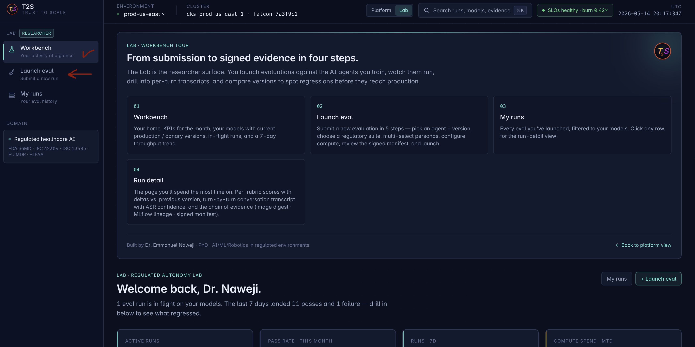
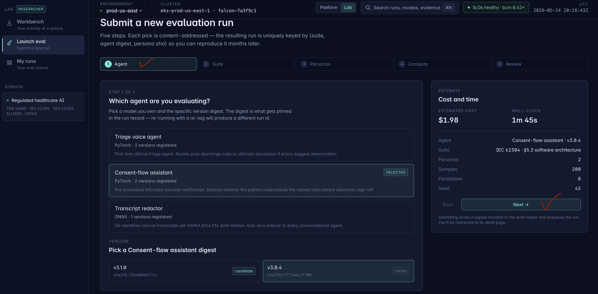
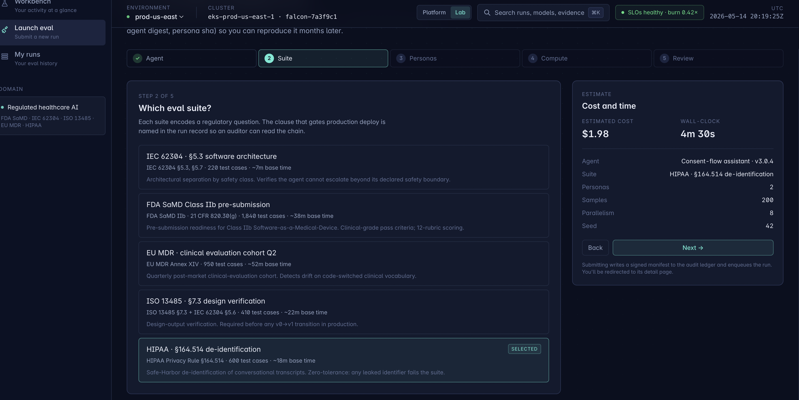
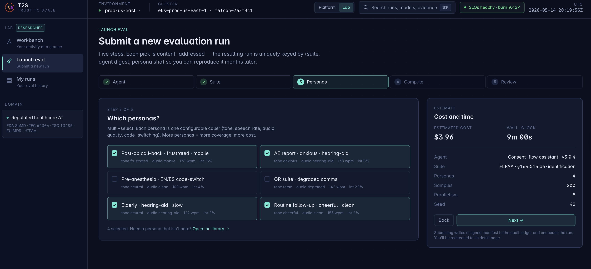
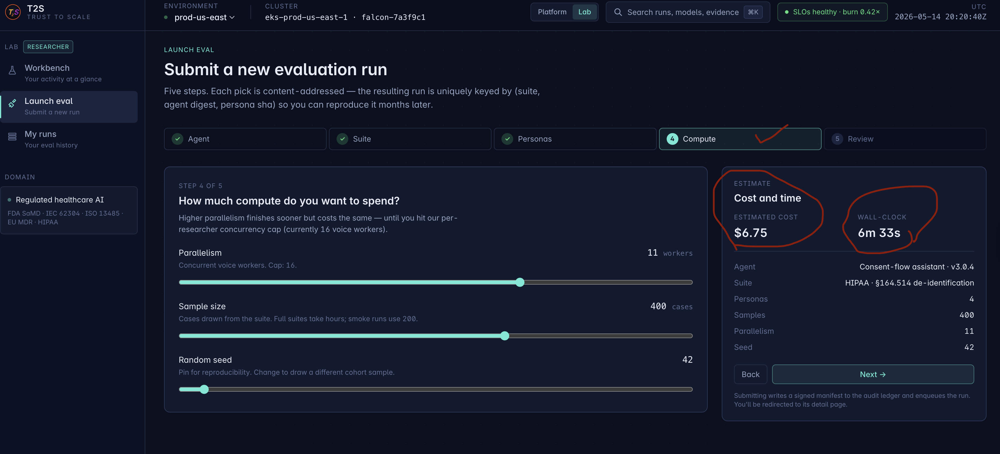
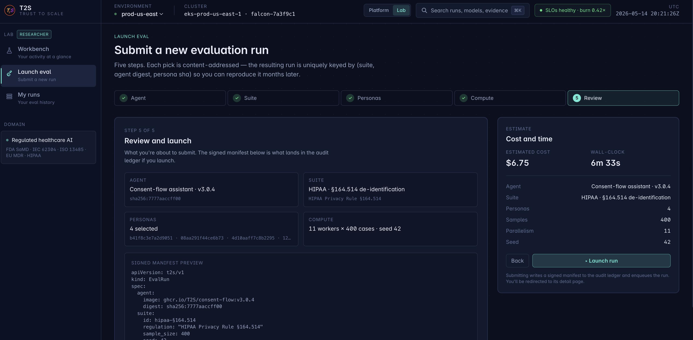

# Demo & deploy guide — T2S operator UI

A practical, copy-pasteable walkthrough for getting the [`t2s-ui`](../workloads/t2s-platform/ui/) in front of someone — whether that someone is *you* in your browser, a researcher on the next floor, an advisor on the other side of the planet, or a hiring manager who opens links on their phone.

There are five paths, ordered roughly by lifetime and effort. Pick by audience, not by "what's coolest" — the right answer for a 30-minute interview demo is different from the right answer for the link in your CV header.

## What you're deploying

T2S has two complementary surfaces sharing one brand:

### Platform-owner view — for SREs and on-call

The dashboard a platform owner uses to monitor every evaluation cohort in flight across regulated healthcare AI/robotics deployments.


### Researcher view (Lab) — for clinical AI researchers

The surface a researcher uses to submit evaluations against the agents they train, watch them run, drill into per-turn transcripts, and compare versions to spot regressions before they reach production. Toggle to it with the **Platform / Lab** switch in the topbar.








The PNGs live in [`docs/screenshots/`](screenshots/) — see [`screenshots/README.md`](screenshots/README.md) for the capture conventions and how to re-shoot after a design change.

---

## Pick a path

| # | Path | Public? | Lifetime | Setup | Best for |
|---|---|---|---|---|---|
| 1 | **Local dev server** | No (localhost only) | While `npm run dev` is alive | seconds | Building, iterating, recording video |
| 2 | **Cloudflare quick tunnel** | Yes, random URL | While `cloudflared` is alive | seconds | Showing a live build to one researcher right now |
| 3 | **Cloudflare Pages** | Yes, stable URL | Indefinite | ~5 minutes (one-time) | A persistent free public URL, no Kubernetes required |
| 4 | **Kind cluster + cloudflared named tunnel** | Yes, stable URL | While the laptop is on | ~10 minutes (one-time) | Showcasing that the UI runs on the repo's own Kubernetes platform |
| 5 | **EKS / GKE / AKS** | Yes, custom domain | Indefinite | hour-ish (one-time) | A real production environment, runs 24/7 |

If you're not sure: start with **(1)** to iterate, use **(2)** for a meeting today. For something persistent that lives past one session: **(3)** is the simplest, **(4)** is the most coherent with this repo's story ("my UI runs on my own Kubernetes platform"), **(5)** is what you want if cost is acceptable and uptime matters.

---

## Path 1 — Local dev server (you, your browser, no audience)

```bash
make ui-dev
# → opens on http://localhost:3000, or auto-falls-back to 3010/3020 if 3000 is taken
```

`make ui-dev` runs `npm install` if `node_modules/` is missing, scans for the first free port among `3000 / 3010 / 3020 / 3030`, and starts `next dev` on it. Set `UI_PORT=3010` to pin.

The raw equivalent (in case `make` isn't your tool of choice):

```bash
cd workloads/t2s-platform/ui
npm install
npx next dev -p 3010
```

### Verifying you're actually hitting T2S

Several things can listen on port 3000 (Docker containers, other Node processes). Before debugging a rendering problem, confirm it's actually T2S responding:

```bash
curl -s http://localhost:3010/api/healthz
# → {"status":"ok","service":"t2s-ui","version":"0.2.0"}
```

If you get a different JSON body or HTML, it's a different service on that port. See "Common gotchas" below.

### Stopping

```bash
pkill -f "next dev"
```

---

## Path 2 — Cloudflare quick tunnel (live demo to one researcher, right now)

A `cloudflared` quick tunnel takes your local dev server and gives you a public `https://*.trycloudflare.com` URL in about 5 seconds. No account, no DNS, no signup. It dies when you kill `cloudflared`.

```bash
# one-time install
brew install cloudflared

# in one terminal — start the UI
make ui-dev

# in another terminal — expose it
make ui-share
# → prints something like https://ver-pillow-info-give.trycloudflare.com
```

### What `make ui-share` does

1. Finds the running `next dev` process and reads its port.
2. Runs `cloudflared tunnel --url http://localhost:<port>`.
3. The first log line with `trycloudflare.com` is your public URL.

### Caveats

- **The URL changes every time you restart `cloudflared`.** Don't put it on a slide that needs to outlive the meeting.
- **No uptime guarantee.** Cloudflare's terms reserve the right to terminate quick tunnels at any time. Fine for a 30-minute meeting; not fine for a CV link.
- **No authentication.** Anyone with the URL can browse the UI. The demo data is fabricated, so that's deliberate here — but if you ever wire this to a real API, do not share a quick-tunnel URL of an authenticated environment.

### Stopping

```bash
pkill -f "cloudflared tunnel"
```

---

## Path 3 — Cloudflare Pages (persistent public URL, no Vercel)

Cloudflare Pages is the closest no-Vercel equivalent: free tier, stable `*.pages.dev` URL, auto-rebuilds on `git push`, custom domain support, no credit card required. Next.js on Pages runs through the `@cloudflare/next-on-pages` adapter, which converts the standalone build into Workers-compatible output.

### One-time setup

```bash
cd workloads/t2s-platform/ui

# Add the Pages adapter as a devDependency.
npm install --save-dev @cloudflare/next-on-pages

# Build the Pages-compatible output.
npx @cloudflare/next-on-pages
# → produces .vercel/output/static (the directory Pages serves)

# Install Wrangler (Cloudflare's CLI) and log in.
npm install --save-dev wrangler
npx wrangler login          # opens browser, OAuth to your Cloudflare account
                            # (sign-up is free; no payment method required)

# Create the Pages project and push the build.
npx wrangler pages project create t2s-ui --production-branch=main
npx wrangler pages deploy .vercel/output/static --project-name=t2s-ui
# → prints https://t2s-ui.pages.dev
```

### After the first deploy

For ongoing deploys, you have two options:

1. **Wire it to GitHub** in the Cloudflare dashboard → Pages → t2s-ui → Settings → Builds. Every push to `main` rebuilds automatically. Build command: `npx @cloudflare/next-on-pages`. Build output directory: `.vercel/output/static`. Build root: `workloads/t2s-platform/ui`.
2. **CLI-only**: re-run `npx @cloudflare/next-on-pages && npx wrangler pages deploy .vercel/output/static --project-name=t2s-ui` whenever you want to ship.

### What to put in your CV / portfolio

`https://t2s-ui.pages.dev` is your stable public URL — link it in your CV header, LinkedIn featured section, conference slide footer. Add a custom domain (Cloudflare dashboard → Pages → t2s-ui → Custom domains) if you own one.

### Trade-offs vs. Vercel

| Property | Cloudflare Pages | (Vercel) |
| --- | --- | --- |
| Free tier covers this UI | yes | yes |
| Custom domain | free | free |
| Auto-deploy on git push | yes (via dashboard wiring) | yes |
| Next.js App Router support | full, via `next-on-pages` adapter | native |
| Server-side runtime | Cloudflare Workers | Vercel functions |
| Cold start | ~10ms | ~50ms |

The adapter has good compatibility but every Next.js feature isn't 100% supported — the [compatibility matrix](https://github.com/cloudflare/next-on-pages/blob/main/packages/next-on-pages/docs/supported.md) is the source of truth. For this UI (server components + simple API route) it works without ceremony.

### Alternatives if Cloudflare Pages doesn't work for you

- **Netlify** — closest 1:1 UX swap. `npx netlify deploy --prod` from `workloads/t2s-platform/ui/`. Free tier, stable URL.
- **Render** — Docker-based. Point it at the repo, set the root directory to `workloads/t2s-platform/ui`, free hobby tier (spins down on inactivity).
- **Fly.io** — Docker-based, deploys the existing `Dockerfile` directly: `fly launch` from the UI directory.

All three give you a stable public URL without depending on Vercel.

---

## Path 4 — Kind cluster + Cloudflare named tunnel (the "my UI runs on my own platform" story)

This is the most thematically consistent path for this repo: the T2S UI runs in your own Kubernetes cluster (locally, on `kind`), and a **named** Cloudflare tunnel — different from the quick tunnel in Path 2 — gives it a stable public hostname on a domain you control.

Trade-off: the cluster needs your laptop to be on. Good enough for an interview-week demo or a CV link if your laptop is your daily driver; not good for 24/7 uptime.

### Why this fits the narrative

Every other "deploy your portfolio" path (Vercel, Pages, Netlify) is a third-party SaaS that abstracts away the platform. But the whole point of *this* repo is the Kubernetes platform you built — running your demo UI inside that platform is the strongest possible story: *"the website you're looking at is served by the same architecture I'm describing."*

### One-time setup

```bash
# 1. local cluster + platform (one-time, if not already up)
make local-up

# 2. build + load the production image into kind
make ui-docker
kind load docker-image ghcr.io/T2S/t2s-ui:0.2.0 --name ai-ml-infra

# 3. deploy the t2s-platform manifests
kubectl apply -f workloads/t2s-platform/namespace.yaml \
              -f workloads/t2s-platform/serviceaccounts.yaml \
              -f workloads/t2s-platform/networkpolicy.yaml \
              -f workloads/t2s-platform/ui.yaml
kubectl -n t2s rollout status rollout/t2s-ui --timeout=180s

# 4. install cloudflared (one-time)
brew install cloudflared
cloudflared tunnel login           # opens browser; you need a Cloudflare account
                                   # + a zone (any domain you own). Free.

# 5. create a named tunnel and point a hostname at it
cloudflared tunnel create t2s-ui
cloudflared tunnel route dns t2s-ui t2s.yourdomain.com

# 6. run the tunnel — points your DNS hostname at the in-cluster Service
kubectl -n t2s port-forward svc/t2s-ui 8080:80 &
cloudflared tunnel --url http://localhost:8080 run t2s-ui
# → https://t2s.yourdomain.com  (stable, doesn't change on restart)
```

### Why named tunnels over quick tunnels

- **Stable hostname.** A quick tunnel gives `https://random-words.trycloudflare.com` and rotates each run. A named tunnel uses your domain, doesn't rotate.
- **Uptime SLA.** Named tunnels are a real Cloudflare product with terms of service; quick tunnels are an experimentation feature.
- **Access control.** Named tunnels can sit behind Cloudflare Access (Google OAuth, email allow-list) if you want the UI gated.

### Running it as a Kubernetes Deployment instead of from your laptop

For a cleaner story you can run `cloudflared` itself as a Pod in the cluster (the [cloudflared-operator](https://github.com/cloudflare/cloudflare-operator) or a plain Deployment with the tunnel credentials mounted as a Secret). At that point the only thing keeping the demo alive is the cluster itself — same uptime as `make local-up`.

### Rehearsing without the tunnel (kind-only, no public URL)

If you just want to verify the manifests work locally:

```bash
kubectl -n t2s port-forward svc/t2s-ui 3000:80
# → http://localhost:3000
```

That covers what Path 1 doesn't: it runs the **production image** under the **production security profile**, in a real Kubernetes namespace. Path 1 won't surface manifest bugs (wrong probe path, missing RBAC, NetworkPolicy too strict) — this will.

### Cleaning up

```bash
cloudflared tunnel cleanup t2s-ui
kubectl delete -f workloads/t2s-platform/ui.yaml
kubectl delete namespace t2s
# or: make local-down  (tears down the whole kind cluster)
```

---

## Path 5 — Real cloud cluster (EKS / GKE / AKS)

This is the "fully wired up" path. Everything below assumes you have credentials for one of the three clouds and that you've reviewed the cost implications — a small EKS cluster sits around $75/month before any GPU nodes attach.

```bash
# 1. provision the cluster + ECR + IRSA (pick one cloud)
make aws-up          # ~12 minutes
# or
make gcp-up
# or
make azure-up

# 2. push the image to the cluster's registry of choice
docker tag  ghcr.io/T2S/t2s-ui:0.2.0  <registry>/t2s-ui:0.2.0
docker push <registry>/t2s-ui:0.2.0

# 3. ArgoCD picks up the t2s-platform Application automatically from Git.
#    The Ingress in workloads/inference-gateway/ingress.yaml gives it a hostname.
#    cert-manager issues TLS via Let's Encrypt.

kubectl -n t2s rollout status rollout/t2s-ui
kubectl -n t2s get ingress         # see the public hostname
```

### Image registry choice

- **AWS** → ECR (`<account>.dkr.ecr.<region>.amazonaws.com/t2s-ui`)
- **GCP** → Artifact Registry (`<region>-docker.pkg.dev/<project>/t2s/t2s-ui`)
- **Azure** → ACR (`<acr>.azurecr.io/t2s-ui`)
- **Anywhere** → GHCR (`ghcr.io/T2S/t2s-ui:0.2.0`) — works on every cloud, costs nothing for public images

GHCR is the simplest path if you don't care about pull latency. The Terraform roots provision per-cloud registry access regardless.

### Custom domain

Set the `host:` in [`workloads/inference-gateway/ingress.yaml`](../workloads/inference-gateway/ingress.yaml) to the domain you control. cert-manager will issue a TLS cert via Let's Encrypt within ~60 seconds.

---

## Screenshots

The screenshots referenced by [`README.md`](../README.md) and [`workloads/t2s-platform/ui/README.md`](../workloads/t2s-platform/ui/README.md) live in [`docs/screenshots/`](screenshots/). See [`screenshots/README.md`](screenshots/README.md) for filenames and capture conventions.

To re-capture from a running dev build:

```bash
make ui-dev                                    # in one terminal
open http://localhost:3010                     # take Cmd+Shift+4+Space per route
# pages: /  /eval-runs  /personas  /compliance  /audit-trail
```

Save the PNGs into `docs/screenshots/` with the filenames the markdown already references.

---

## Common gotchas

### "Port 3000 is in use" / wrong service in the browser

Something else (often a Docker container) is listening on 3000 and your browser is hitting it. Find it:

```bash
lsof -nP -iTCP:3000 -sTCP:LISTEN          # what's bound to 3000
docker ps                                  # if it's a container
```

Then either stop the offending service or run T2S on a different port (`make ui-dev UI_PORT=3010`). `curl -s http://localhost:<port>/api/healthz` should return `{"service":"t2s-ui",...}` — if it returns anything else, you're hitting the wrong process.

### `npm install` hangs / fails on Apple Silicon

The Next.js build does not need native modules; if `npm install` is hanging it's almost always a network/registry issue, not a platform issue. Try:

```bash
npm config get registry        # should be https://registry.npmjs.org/
rm -rf node_modules package-lock.json
npm cache clean --force
npm install --no-audit --no-fund
```

### "EADDRINUSE" from `next dev` after a crash

A previous `next dev` died but the port is still bound. Easiest reset:

```bash
pkill -f "next dev"
rm -rf workloads/t2s-platform/ui/.next
make ui-dev
```

### Cloudflare tunnel URL won't load for 10–20 seconds

Quick tunnels propagate through Cloudflare's edge before the URL is reachable. Wait ~15s. If it's still failing, check the tunnel log:

```bash
tail -50 /tmp/t2s-tunnel.log     # if you used `make ui-share`
# or
cloudflared tunnel --url http://localhost:3010   # run it foreground to see live logs
```

### Vercel build fails with a Tailwind error

Make sure `tailwind.config.ts` and `postcss.config.mjs` are committed and not gitignored. The Vercel build runs `npm install && npm run build` from a fresh clone — anything ignored locally won't be there.

---

## Quick reference — every command in one place

```bash
# dev
make ui-dev                            # local dev server, auto-port

# share live to one researcher
brew install cloudflared               # one-time
make ui-share                          # public URL while it runs

# stable public deploy
cd workloads/t2s-platform/ui
npx vercel --prod                      # CV-grade stable URL

# production-grade image
make ui-docker                         # builds ghcr.io/T2S/t2s-ui:0.2.0
make ui-build                          # standalone server only, no image

# stop everything
pkill -f "next dev"
pkill -f "cloudflared tunnel"
```
